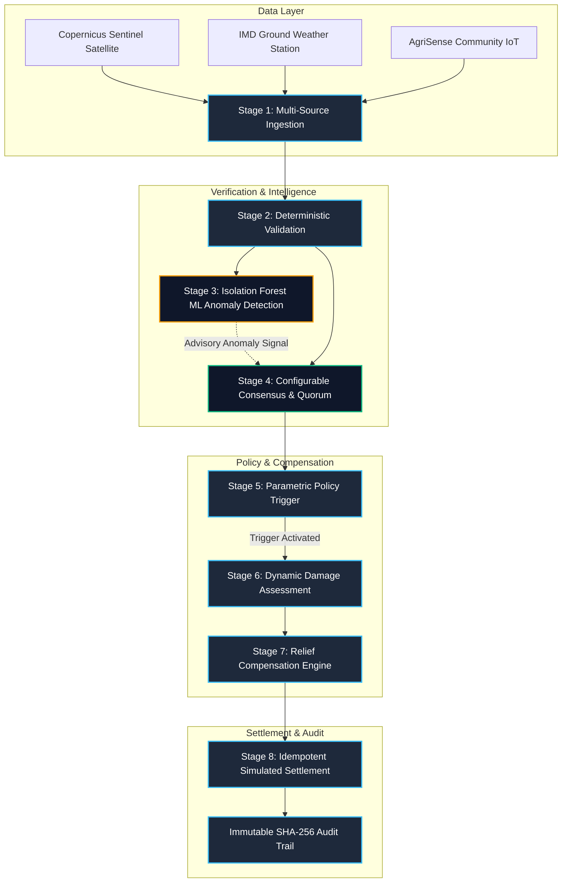

# Risk2Relief

### Autonomous Parametric Climate Insurance & Instant Relief Settlement Engine

<div align="center">

[](https://fastapi.tiangolo.com)
[](https://python.org)
[](https://react.dev)
[](https://www.typescriptlang.org)
[](https://vitejs.dev)
[](https://scikit-learn.org)
[](https://www.postgresql.org)
[](https://www.docker.com)
[-brightgreen.svg?style=flat&logo=pytest&logoColor=white)](https://pytest.org)
[]()

**A high-reliability autonomous decision platform that transforms multi-source climate telemetry into validated, consensus-driven, and instant relief disbursements for vulnerable communities.**

</div>

---

> [!NOTE]
> ### 🛡️ SIMULATION & HACKATHON ENVIRONMENT NOTICE
> **Risk2Relief is a prototype and simulation platform.** All financial disbursements, recipient wallets, transaction hashes, and policy settlements are executed strictly **in-silico**. No real fiat or cryptocurrency is moved. Machine learning models function strictly as **advisory reliability layers** and do not directly command financial payouts.

---

## One-Line Value Proposition

**Risk2Relief transforms volatile climate telemetry into a dependable, deterministic, and cryptographically auditable automated relief pipeline—eliminating weeks of insurance claim friction to deliver verified disaster assistance in sub-second latency.**

---

## The Problem

Climate change is driving an unprecedented surge in localized extreme weather events—including flash floods, cloudbursts, unseasonal torrential rain, heatwaves, and agricultural droughts. When disasters strike:

1. **Catastrophic Liquidity Crunches**: Smallholder farmers, daily wage laborers, street vendors, and local shopkeepers face immediate loss of livelihood and perishable inventories without emergency capital buffers.
2. **Traditional Indemnity Insurance Friction**: Conventional insurance processes require manual claim filing, paperwork, on-site loss adjusters, and bureaucratic verification. Payouts routinely take **45 to 120 days** to arrive—long after the window for critical relief has closed.
3. **High Administrative & Assessment Costs**: Verifying small claims for thousands of distributed micro-policyholders is economically unviable for traditional underwriters, leaving millions of vulnerable workers uninsurable.
4. **Data Reliability & Sensor Spoofing Risks**: Automated parametric systems risk false triggers or fraudulent claims due to sensor hardware failures, calibration drift, communication dropouts, or adversarial telemetry tampering.

```
TRADITIONAL CLAIM MODEL:
Disaster Event ──> Manual Claim ──> Loss Adjuster Visit ──> Dispute / Review ──> Payout (45–120 Days)

RISK2RELIEF PARAMETRIC ENGINE:
Climate Telemetry ──> Validation ──> ML Anomaly Check ──> Consensus ──> Instant Settlement (< 500 ms)
```

---

## The Solution

Risk2Relief solves the speed-versus-reliability paradox by coupling **multi-source climate cross-corroboration** with an **8-stage deterministic decision pipeline**:

1. **Multi-Source Ingestion**: Ingests contemporaneous telemetry from independent provider tiers (Copernicus Radar Satellites, IMD Ground Automated Weather Stations, and AgriSense Community IoT rain gauges).
2. **Deterministic Data Validation**: Checks physical bounds ($0 - 1200\text{ mm}$), engineering units, future/stale timestamp drift, and deduplication.
3. **Isolation Forest ML Anomaly Detection**: An advisory machine-learning layer (`sklearn.ensemble.IsolationForest`) trained on a 605-sample multi-regime historical baseline detects statistical outliers, sensor dropouts, and spoofing attempts.
4. **Source Independence & Quorum Consensus**: Enforces provider group separation and applies weighted median calculations with configurable tolerance bands to prevent single-source corruption from forcing a trigger.
5. **Deterministic Parametric Trigger**: Compares verified consensus against objective, predefined contractual thresholds (e.g. 24h rainfall $\ge 150.0\text{ mm}$).
6. **Dynamic Damage Assessment**: Tailors loss estimation across diverse occupations (farmers, shopkeepers, daily wage laborers) with dynamic form filters and normalized unit conversion.
7. **Rule-Based Compensation Calculation**: Applies transparent mathematical formulas with strict policy maximum caps.
8. **Simulated Instant Settlement**: Generates deterministic idempotency keys and executes simulated instant wallet disbursements with zero double-payout risk.
9. **Immutable SHA-256 Audit Trail**: Cryptographically hashes and logs every decision step for regulatory compliance and transparency.

---

## Who It Is For

### Primary Beneficiaries & Claimants
- 🌾 **Smallholder Farmers**: Automatic protection for crops (paddy, wheat, sugarcane, cotton, vegetables) against flash floods and unseasonal rainfall.
- 🏪 **Local Shopkeepers & Retailers**: Immediate inventory and premises relief for grocery stores, pharmacies, hardware shops, and electronics outlets.
- 🔨 **Daily Wage & Informal Laborers**: Income-loss compensation for construction workers, agricultural laborers, and street vendors during disaster shutdowns.

### Institutional & Infrastructure Stakeholders
- 🏛️ **Parametric Insurers & Underwriters**: Zero-overhead, fraud-resilient automated policy administration and risk pricing.
- 🏛️ **Disaster Relief & Government Agencies**: Transparent, auditable emergency capital disbursement mechanisms for disaster zones.
- 🏦 **Microfinance Institutions (MFIs) & Cooperatives**: Automated loan-loss protection for agricultural and micro-business credit portfolios.
- 📡 **Weather & Satellite Telemetry Providers**: Direct oracle data integration with multi-source reliability scoring.

---

## Core Climate-to-Relief Workflow

```
[1] Climate Telemetry Ingestion (Copernicus Sat + IMD Ground + Community IoT)
         │
[2] Deterministic Validation (Physical bounds, units, freshness, deduplication)
         │
[3] Isolation Forest ML Anomaly Check (Advisory outlier scoring vs reference data)
         │
[4] Source Independence & Quorum Consensus (Weighted median across distinct groups)
         │
[5] Parametric Policy Trigger Evaluation (Deterministic threshold verification)
         │
[6] Dynamic Damage Assessment (Occupation-tailored loss input & unit normalization)
         │
[7] Rule-Based Compensation Calculation (Rate formulas & maximum payout caps)
         │
[8] Instant Settlement Engine (Deterministic idempotency key generation)
         │
[9] Simulated Instant Wallet Disbursement (Zero-loss in-silico ledger update)
         │
[10] Immutable Audit Trail Logging (Complete decision record with SHA-256 timestamps)
```

---

## Live Decision Pipeline

The core of Risk2Relief is the **Live Decision Pipeline**, executing all verification, intelligence, and settlement steps sequentially:



### Pipeline Stage Details

| Stage | Name | Role | Authoritative / Advisory | Key Guarantees |
| :---: | :--- | :--- | :---: | :--- |
| **01** | **Multi-Source Ingestion** | Ingests concurrent observations from distinct provider tiers. | Authoritative | Retains raw observation metadata and provider group IDs. |
| **02** | **Deterministic Validation** | Validates physical bounds ($0-1200\text{ mm}$), timestamps, and units. | Authoritative | Rejects corrupt, stale ($>4\text{h}$), future ($>5\text{min}$), or unphysical values. |
| **03** | **Isolation Forest ML** | Scores observations against reference distributions & peer spread. | **ADVISORY ONLY** | Outputs `anomaly_score` ($0.0-1.0$); never commands payout. |
| **04** | **Consensus & Quorum** | Enforces $\ge 2$ independent provider groups and calculates weighted median. | Authoritative | Blocks triggers if peer disagreement or uncorroborated outliers exist. |
| **05** | **Parametric Trigger** | Evaluates contractual operator (e.g. $\text{Rainfall} \ge 150.0\text{ mm}$). | Authoritative | Pure deterministic Boolean evaluation against active policy terms. |
| **06** | **Damage Assessment** | Captures occupation-specific damage details with normalized units. | Authoritative | Normalizes land areas (cents to acres) and categorizes store losses. |
| **07** | **Compensation Engine** | Computes relief amount via standardized rate formulas. | Authoritative | Enforces policy payout maximum caps (e.g. ₹25,000 / ₹50,000). |
| **08** | **Instant Settlement** | Dispatches simulated payment to recipient digital wallet. | Authoritative | Enforces deterministic idempotency keys: **Zero duplicate payouts**. |

---

## Machine Learning Anomaly Detection Layer

Risk2Relief integrates **scikit-learn's `IsolationForest`** as a dedicated advisory reliability oracle:

```
 CONTEMPORANEOUS READINGS            ISOLATION FOREST PIPELINE              ADVISORY SIGNAL
┌────────────────────────┐      ┌───────────────────────────────┐      ┌──────────────────────┐
│ Sat:    158.0 mm (Sat) │      │ Feature Extraction:           │      │ S1: Score=0.14 Normal│
│ Ground: 156.0 mm (Grd) │ ───> │ [val, dev_med, robust_z, rel] │ ───> │ S2: Score=0.12 Normal│
│ IoT:     17.0 mm (IoT) │      │ Scoring vs 605-sample baseline│      │ S3: Score=0.72 ANOMAL│
└────────────────────────┘      └───────────────────────────────┘      └──────────────────────┘
```

- **Algorithm**: `sklearn.ensemble.IsolationForest` (`n_estimators=100`, `contamination=0.08`, `random_state=42`).
- **Reference Training Dataset**: 605 simulated multi-regime historical observations covering dry spells, light showers, heavy monsoon floods ($120-180\text{ mm}$), torrential downpours ($180-240\text{ mm}$), and synthetic sensor noise.
- **Multivariate Feature Matrix**:
  - `value`: Raw observed metric.
  - `dev_from_median`: Absolute deviation $|x_i - \text{median}(X)|$.
  - `robust_z_score`: Normal-consistent MAD-scaled dispersion $\frac{|x_i - \text{median}(X)|}{1.4826 \cdot \text{MAD}(X)}$.
  - `relative_ratio`: Cluster ratio $\frac{x_i}{\max(1.0, \text{median}(X))}$.
- **Sigmoid Score Normalization**:
  $$S_{\text{norm}} = \frac{1}{1 + e^{6 \cdot \text{decision\_score}}}$$
- **Fail-Safe Invariant**: If scikit-learn is unavailable or feature extraction fails, the system logs `ML_ANOMALY_CHECK_UNAVAILABLE`, marks status as `LIMITED`, and falls back safely to deterministic bounds without halting the platform.

---

## Dynamic Damage Assessment & Relief Subsystem

The platform provides dynamic, occupation-tailored damage assessment forms with automated compensation calculation:

### Supported Occupations & Dynamic Fields

| Occupation | Dynamic Form Fields | Normalization Rules | Compensation Rate Formula |
| :--- | :--- | :--- | :--- |
| **Farmer** | Crop type (Paddy, Wheat, Sugarcane, Cotton, etc.), Damaged Area, Unit (Acres / Cents), Damage Severity | $1\text{ Acre} = 100\text{ Cents}$. Normalizes to standard acres. | $\text{Acres} \times \text{Crop Rate} \times \text{Severity Factor}$. Max cap: ₹50,000. |
| **Shopkeeper** | Store type (Grocery, Pharmacy, Clothing, Hardware), Inventory Damage Band, Damage Category | Maps inventory bands into baseline asset value. | $\text{Inventory Band Base} \times \text{Category Factor}$. Max cap: ₹75,000. |
| **Daily Wage Worker** | Work type (Construction, Agri Labor, Street Vendor), Days Lost, Severity | Normalizes to lost work days. | $\text{Days Lost} \times \text{Daily Rate (₹600)} \times \text{Severity}$. Max cap: ₹20,000. |

---

## Benchmark Demo Scenarios

Risk2Relief includes 4 pre-packaged benchmark scenarios plus dynamic custom inputs:

```
┌───────────────────────────────────────────────────────────────────────────────────────────────┐
│ BENCHMARK SCENARIO EXECUTION MATRIX                                                           │
├──────────────────────┬──────────────────────┬─────────────┬─────────────┬─────────────────────┤
│ Scenario             │ Input Telemetry      │ ML Status   │ Consensus   │ Final Outcome       │
├──────────────────────┼──────────────────────┼─────────────┼─────────────┼─────────────────────┤
│ 1: Success           │ 158 / 154 / 156 mm   │ Clean (0.14)│ 156.0 mm    │ ₹25,000 Settled     │
│ 2: Disagreement      │ 158 / 156 / 17 mm    │ Outlier(0.72│ BLOCKED     │ ₹0 Suppressed       │
│ 3: No Trigger        │ 120 / 118 / 121 mm   │ Clean (0.12)│ 120.0 mm    │ ₹0 (Sub-threshold)  │
│ 4: Idempotent Retry  │ Resubmit Scenario 1  │ Clean (0.14)│ 156.0 mm    │ ₹0 Duplicate Loss   │
│ Dynamic Arbitrary    │ e.g. 173/169/171 mm  │ Live Scored │ Evaluated   │ Evaluated Live      │
└──────────────────────┴──────────────────────┴─────────────┴─────────────┴─────────────────────┘
```

---

## Technology Stack

| Subsystem | Technologies & Libraries | Purpose |
| :--- | :--- | :--- |
| **Frontend UI** | React 18, TypeScript, Vite, TanStack React Query, Lucide Icons | Responsive glassmorphic dashboard & live visualizer. |
| **Backend API** | Python 3.12+, FastAPI, Pydantic v2, Starlette | High-performance asynchronous REST API gateway. |
| **Machine Learning** | scikit-learn (`sklearn.ensemble.IsolationForest`), NumPy | Advisory multi-source climate anomaly detection. |
| **Database & ORM** | PostgreSQL 16, SQLAlchemy 2.0 (asyncpg), Alembic | Relational storage for policies, sources, and assessments. |
| **Settlement & Audit**| In-memory transactional ledger, SHA-256 audit trail | High-throughput idempotent simulated settlement engine. |
| **Testing & QA** | Pytest 7.4+, Pytest-AsyncIO, HTTPX | 179 comprehensive automated unit and integration tests. |
| **DevOps & Containers**| Docker, Docker Compose, Nginx, Shell/PowerShell scripts | Containerized local and staging deployment. |

---

## Monorepo Directory Architecture

```
Risk2Relief/
├── backend/                          # FastAPI Python backend service
│   ├── app/
│   │   ├── api/v1/                   # REST API routes
│   │   │   ├── climate_api.py        # Sources, policies, and audit endpoints
│   │   │   ├── damage_assessment_api.py # Dynamic damage assessment & calculation
│   │   │   ├── demo_api.py           # Benchmark scenarios & dynamic pipeline runner
│   │   │   └── health.py             # System health checks
│   │   ├── climate/                  # Core parametric & consensus engines
│   │   │   ├── anomaly.py            # Isolation Forest ML anomaly detector
│   │   │   ├── audit_trail.py        # Cryptographic audit logging service
│   │   │   ├── consensus.py          # Multi-source independence & weighted median
│   │   │   ├── damage_engine.py      # Dynamic damage calculation engine
│   │   │   ├── policy_engine.py      # Deterministic parametric trigger engine
│   │   │   ├── settlement_engine.py  # Idempotent simulated settlement engine
│   │   │   ├── simulator.py          # End-to-end scenario pipeline orchestrator
│   │   │   └── validation.py         # Physical bounds & telemetry validation
│   │   ├── core/                     # Central application configuration & DB setup
│   │   ├── models/                   # SQLAlchemy declarative database models
│   │   ├── schemas/                  # Pydantic v2 validation contracts
│   │   └── main.py                   # FastAPI application entrypoint & middleware
│   ├── tests/                        # Backend test suite (179 tests, 100% passing)
│   │   ├── test_isolation_forest_climate.py # ML model unit & integration tests
│   │   ├── test_risk2relief_pipeline.py     # End-to-end pipeline & scenario tests
│   │   ├── test_damage_assessment.py        # Damage calculation & filter tests
│   │   └── ...                              # Core domain & API tests
│   ├── Dockerfile                    # Multi-stage Python container
│   └── pyproject.toml                # Dependencies & package metadata
├── frontend/                         # React 18 + TypeScript + Vite dashboard
│   ├── src/
│   │   ├── api/                      # Native fetch client & React Query hooks
│   │   ├── components/               # UI components
│   │   │   ├── DemoControlPanel.tsx  # Dynamic telemetry input & scenario launcher
│   │   │   ├── PipelineVisualizer.tsx# Live 8-stage decision pipeline visualizer
│   │   │   ├── DamageAssessmentView.tsx # Dynamic damage assessment workflow
│   │   │   ├── ExecutiveOverview.tsx # KPI summary & active event tracker
│   │   │   ├── ClimateSourcesTable.tsx# Telemetry oracle source registry
│   │   │   ├── PoliciesView.tsx      # Parametric policy management
│   │   │   ├── SettlementsView.tsx   # Simulated transaction ledger
│   │   │   └── AuditTimelineView.tsx # Immutable audit log inspector
│   │   ├── types/                    # TypeScript interfaces & domain contracts
│   │   ├── App.tsx                   # Main layout shell & tab routing
│   │   ├── index.css                 # Glassmorphic CSS design system
│   │   └── main.tsx                  # React application mount
│   ├── index.html                    # HTML document entrypoint
│   ├── package.json                  # Frontend dependencies
│   ├── tsconfig.json                 # TypeScript compiler configuration
│   └── vite.config.ts                # Vite bundler & backend proxy config
├── docs/                             # In-depth architectural & technical guides
│   ├── ML_ISOLATION_FOREST.md        # Isolation Forest ML layer documentation
│   ├── DAMAGE_ASSESSMENT.md          # Damage assessment dynamic engine spec
│   ├── architecture.md               # Structural design & system architecture
│   └── development-setup.md          # Local developer setup instructions
├── scripts/                          # Developer automation & demo runners
│   ├── run_risk2relief_demo.py       # Console demo execution script
│   ├── dev-setup.ps1 / .sh           # Local environment initialization
│   └── run-checks.ps1 / .sh          # Test and lint validation scripts
├── docker-compose.yml                # Multi-service local orchestration
└── README.md                         # Root platform documentation
```

---

## Quick Start & Developer Guide

### Prerequisites
- **Python 3.12+**
- **Node.js 20+** and **npm**
- **Docker & Docker Compose** (optional for containerized run)

---

### Method A: Local Independent Execution (Recommended for Fast Iteration)

#### 1. Backend Service
```bash
cd backend

# Create virtual environment (optional)
python -m venv .venv
# On Windows: .venv\Scripts\activate
# On Linux/macOS: source .venv/bin/activate

# Install dependencies
pip install -e ".[dev]"

# Start FastAPI development server
uvicorn app.main:app --host 0.0.0.0 --port 8000 --reload
```
- **Backend API:** [http://localhost:8000](http://localhost:8000)
- **Interactive Swagger UI:** [http://localhost:8000/docs](http://localhost:8000/docs)
- **Health Check:** [http://localhost:8000/health](http://localhost:8000/health)

#### 2. Frontend Web Application
```bash
cd frontend

# Install Node dependencies
npm install

# Start Vite dev server
npm run dev
```
- **Frontend Dashboard:** [http://localhost:5173](http://localhost:5173)

---

### Method B: Docker Compose Execution

Run the complete multi-tier containerized stack:

```bash
docker compose up --build
```

---

### Method C: Run the Console Judge Demo Script

Execute all 4 core scenarios directly in your terminal with colored pipeline traces:

```bash
python scripts/run_risk2relief_demo.py
```

---

## Verification & Automated Testing

Run the complete automated test suite (179 tests across pipeline, ML anomaly detection, consensus, damage assessment, settlement, and safety):

```bash
# Run all backend tests
python -m pytest backend/tests -v

# Run ML Isolation Forest tests specifically
python -m pytest backend/tests/test_isolation_forest_climate.py -v

# Run dynamic damage assessment tests specifically
python -m pytest backend/tests/test_damage_assessment.py -v

# Validate frontend TypeScript build
cd frontend && npm run build
```

---

## REST API Specification Summary

| Method | Endpoint | Description |
| :--- | :--- | :--- |
| `GET` | `/health` | Root system health check. |
| `GET` | `/api/v1/dashboard/summary` | Executive dashboard KPI summary. |
| `POST` | `/api/v1/demo/dynamic-run` | **Run live dynamic pipeline with arbitrary 3-source telemetry**. |
| `POST` | `/api/v1/demo/scenario/success` | Execute Scenario 1 (Corroborated Extreme Rainfall $\rightarrow$ Payout). |
| `POST` | `/api/v1/demo/scenario/disagreement` | Execute Scenario 2 (Sensor Anomaly $\rightarrow$ Payout Blocked). |
| `POST` | `/api/v1/demo/scenario/no-trigger` | Execute Scenario 3 (Nominal Monsoon $\rightarrow$ No Trigger). |
| `POST` | `/api/v1/demo/scenario/idempotency` | Execute Scenario 4 (Duplicate Retry $\rightarrow$ Zero Loss). |
| `POST` | `/api/v1/demo/reset` | Reset simulation ledger and audit trail. |
| `GET` | `/api/v1/climate/sources` | List registered climate telemetry sources. |
| `GET` | `/api/v1/policies` | List active parametric insurance policies. |
| `GET` | `/api/v1/settlements` | Query simulated settlement transaction ledger. |
| `GET` | `/api/v1/climate/audit` | Query immutable SHA-256 audit trail events. |
| `POST` | `/api/v1/damage-assessments/calculate`| Calculate dynamic relief compensation. |
| `POST` | `/api/v1/damage-assessments` | Create and persist a new damage assessment. |
| `GET` | `/api/v1/damage-rules` | Query active damage compensation rule catalog. |

---

## Critical System Invariants & Safety Guarantees

```
┌────────────────────────────────────────────────────────────────────────────────────────┐
│ RISK2RELIEF ARCHITECTURAL SAFETY INVARIANTS                                            │
├────────────────────────────────────────────────────────────────────────────────────────┤
│ 1. ADVISORY ML ONLY      │ Isolation Forest ML outputs reliability intelligence.       │
│                          │ ML NEVER directly commands, triggers, or executes payouts.  │
├──────────────────────────┼─────────────────────────────────────────────────────────────┤
│ 2. DETERMINISTIC TRIGGER │ Contractual trigger conditions are evaluated via strict     │
│                          │ Boolean comparisons against validated consensus telemetry.  │
├──────────────────────────┼─────────────────────────────────────────────────────────────┤
│ 3. IDEMPOTENT SETTLEMENT │ Every settlement derives a unique deterministic key.        │
│                          │ Retries return existing transaction; ZERO double payouts.   │
├──────────────────────────┼─────────────────────────────────────────────────────────────┤
│ 4. IMMUTABLE AUDIT TRAIL │ Every stage transition, outlier flag, and disbursement is   │
│                          │ recorded with UTC ISO 8601 timestamps and SHA-256 metadata. │
├──────────────────────────┼─────────────────────────────────────────────────────────────┤
│ 5. SIMULATION ISOLATION  │ All wallets and settlements are synthetic in-silico mocks.  │
│                          │ Zero real currency or financial risk is involved.           │
└──────────────────────────┴─────────────────────────────────────────────────────────────┘
```

---

<div align="center">

**Risk2Relief** &bull; Autonomous Parametric Climate Insurance & Instant Settlement Engine  
*Hackathon Prototype v1.0 &bull; Built with FastAPI, scikit-learn, React, and TypeScript*

</div>
