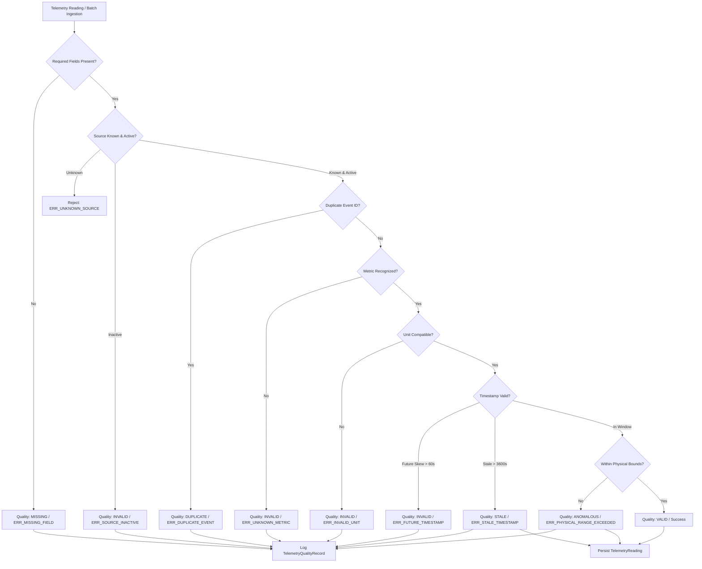

# Risk2Relief: Telemetry Processing, Aggregation & Intelligence Pipeline

## 1. Overview & System Boundary

The Risk2Relief Telemetry Pipeline is a high-throughput, deterministic processing engine engineered to ingest, validate, deduplicate, aggregate, and evaluate physical sensor observations and in-silico simulation feeds for digital-twin structural monitoring.

```
+-------------------------------------------------------------------------------------------------------+
|                                    RISK2RELIEF TELEMETRY PIPELINE                                      |
+-------------------------------------------------------------------------------------------------------+
|                                                                                                       |
|  [ Physical Sensors (Read-Only) ]        [ Deterministic In-Silico Simulator (8 Scenarios) ]         |
|              │                                                          │                             |
|              ▼                                                          ▼                             |
|  ============================== UNIFIED INGESTION BOUNDARY ========================================== |
|  [ Ingestion Service: app/services/telemetry_service.py ]                                             |
|              │                                                                                        |
|              ▼                                                                                        |
|  [ Deterministic Validation Engine: app/telemetry/validation.py ]                                     |
|        ├── 1. Schema & Required Fields Check                                                          |
|        ├── 2. Source Registration & Status Check                                                      |
|        ├── 3. Duplicate Detection: UNIQUE(source_id, event_id)                                         |
|        ├── 4. Metric Compatibility Check (strain, vibration, temp, load, etc.)                         |
|        ├── 5. Metric-Unit Verification Check (allowed unit symbols)                                   |
|        ├── 6. Timestamp Sanity: Max Future Drift (60s) & Max Staleness (3600s)                        |
|        └── 7. Physical Plausibility Boundaries (min/max physical bounds)                              |
|              │                                                                                        |
|              ▼                                                                                        |
|  [ Quality Classification: VALID | ANOMALOUS | STALE | DUPLICATE | INVALID | MISSING ]                |
|              │                                                                                        |
|              ├───► [ TelemetryQualityRecord Audit Log (Incident DB) ]                                  |
|              └───► [ TelemetryReading Persistence (Optimized Time-Series Indexes) ]                    |
|                          │                                                                            |
|                          ▼                                                                            |
|        [ Multi-Resolution Aggregation Engine: app/telemetry/aggregation.py ]                         |
|              ├── Buckets: 1s, 10s, 1m, 5m, 15m                                                        |
|              ├── Statistics: min, max, mean, median, stddev, count, valid/invalid                     |
|              └── Analytics: moving_average, rate_of_change, baseline_deviation_percentage             |
|                          │                                                                            |
|                          ▼                                                                            |
|        [ Source Health & Explainable Reliability Engine: app/telemetry/source_health.py ]             |
|              ├── Availability (sampling rate vs actual count)                                         |
|              ├── Accuracy (1 - error_rate), Anomaly rate, Freshness factor                            |
|              ├── Explainable Reliability Score (0.0 to 1.0) with component breakdown                  |
|              └── Observational / Diagnostic Only (Non-actuating Safety Boundary)                       |
+-------------------------------------------------------------------------------------------------------+
```

### Safety Invariants
1. **In-Silico Processing Only**: Structural anomaly signals and simulated gravity mitigations are computed in-memory; no commands are sent to physical hardware actuators.
2. **Unified Pipeline**: Synthetic telemetry produced by the deterministic simulator passes through the exact same validation, deduplication, and quality logging pipeline as external sensor telemetry.
3. **Diagnostic Reliability**: Source health scores are observational indicators for operations and digital-twin calibration, never autonomous safety cutoffs.

---

## 2. Ingestion & Validation Architecture

The validation pipeline enforces deterministic, rule-based checks without relying on black-box heuristics for basic schema and physical plausibility.



### 2.1 Machine-Readable Error Codes

| Error Code | HTTP / Quality | Description |
| :--- | :--- | :--- |
| `ERR_MISSING_FIELD` | `MISSING` | Mandatory payload fields (`event_id`, `metric`, `value`, `unit`, `timestamp`) omitted or null |
| `ERR_UNKNOWN_SOURCE` | `INVALID` | Sensor `source_id` is not registered in the platform database |
| `ERR_SOURCE_INACTIVE` | `INVALID` | Sensor is registered but marked `OFFLINE` or `FAULT` |
| `ERR_DUPLICATE_EVENT` | `DUPLICATE` | Identical `(source_id, event_id)` already received and processed |
| `ERR_UNKNOWN_METRIC` | `INVALID` | Telemetry metric string is not registered in the metric catalog |
| `ERR_INVALID_UNIT` | `INVALID` | Unit provided is incompatible with the specified metric specification |
| `ERR_FUTURE_TIMESTAMP`| `INVALID` | Reading timestamp exceeds current server time + 60s clock skew |
| `ERR_STALE_TIMESTAMP` | `STALE` | Reading timestamp is older than 3600s (1 hour staleness threshold) |
| `ERR_PHYSICAL_RANGE_EXCEEDED` | `ANOMALOUS` | Value is outside plausible physical boundaries for the metric |

---

## 3. Metric & Physical Specification Catalog

The validation engine evaluates readings against strict physical boundaries and allowable engineering unit representations:

| Metric Identifier | Allowable Units | Min Plausible | Max Plausible | Description |
| :--- | :--- | :--- | :--- | :--- |
| `strain_microstrain` | `um/m`, `microstrain`, `με`, `ue` | -10,000.0 | 10,000.0 | Structural tensile / compressive strain |
| `vibration_hz` | `Hz`, `hz` | 0.0 | 1,000.0 | Dominant structural oscillation frequency |
| `temperature_celsius` | `C`, `degC`, `celsius`, `°C` | -50.0 | 120.0 | Ambient or structural temperature |
| `load_kn` | `kN`, `kn` | -1,000.0 | 50,000.0 | Structural column or beam loading |
| `inclination_deg` | `deg`, `degree`, `°` | -45.0 | 45.0 | Angular deflection from vertical plumb |
| `pressure_kpa` | `kPa`, `kpa` | 50.0 | 200.0 | Barometric or hydraulic fluid pressure |
| `air_quality_aqi` | `AQI`, `aqi`, `index` | 0.0 | 500.0 | Indoor air quality index |

---

## 4. Multi-Resolution Aggregation Engine

To support real-time digital-twin dashboards and high-speed analytical queries without scanning millions of raw rows, the aggregation engine provides deterministic multi-resolution bucketing:

### 4.1 Resolution Buckets
- **`1s`**: High-frequency transient analysis (seismic events, immediate shock loads)
- **`10s`**: Near real-time digital-twin operational monitoring
- **`1m`**: Standard short-term structural trend monitoring
- **`5m`**: Medium-term thermal expansion and cyclic load analysis
- **`15m`**: Long-term structural baseline shift tracking

### 4.2 Computed Statistical Metrics
For each temporal window `[start_time, end_time)`:
- `count`: Total observations received
- `valid_count`: Readings validated as strictly `VALID`
- `invalid_count`: Readings flagged as anomalous, stale, or invalid
- `min_value`: Minimum value among valid readings
- `max_value`: Maximum value among valid readings
- `mean_value`: Arithmetic average of valid readings
- `median_value`: Statistical median of valid readings
- `stddev`: Standard deviation of valid readings (Bessel-corrected sample standard deviation)

### 4.3 Derived Analytical Indicators
- **`moving_average`**: 5-period rolling moving average of window means
- **`rate_of_change`**: First derivative of mean over time: $(\text{mean}_t - \text{mean}_{t-1}) / \Delta t$ (units/second)
- **`baseline_deviation_percentage`**: Relative deviation from reference calibration baseline: $((\text{mean} - \text{baseline}) / |\text{baseline}|) \times 100\%$

---

## 5. Explainable Source Health & Reliability Intelligence

The platform computes deterministic reliability scores for each telemetry source over rolling evaluation windows (default 3600 seconds).

### 5.1 Mathematical Reliability Model

$$\text{Fidelity} = 0.40 \times (1 - R_{\text{err}}) + 0.25 \times (1 - R_{\text{anom}}) + 0.20 \times A + 0.15 \times F$$

$$\text{Reliability Score} = \min(1.0, \max(0.0, \text{Fidelity} \times P_{\text{err}} \times M_{\text{status}}))$$

Where:
- $R_{\text{err}}$: Error rate ($\text{errors} / \text{total}$)
- $R_{\text{anom}}$: Anomaly rate ($\text{anomalies} / \text{total}$)
- $A$: Availability ($\min(1.0, \text{total} / (\text{sampling\_rate\_hz} \times \text{window\_secs}))$)
- $F$: Freshness factor ($\max(0.0, 1.0 - (\text{freshness\_seconds} / 3600.0))$)
- $P_{\text{err}}$: Error penalty scaling factor $\max(0.1, 1.0 - R_{\text{err}})$
- $M_{\text{status}}$: Operational status multiplier (`ONLINE`: 1.0, `OFFLINE`: 0.4, `FAULT`: 0.1)

### 5.2 Health Classification
A telemetry source is classified as `is_healthy = True` if and only if:
1. Operational status is `ONLINE`
2. Reliability score is $\ge 0.70$
3. Error rate is $< 15\%$

### 5.3 Auditability & Explainability
Every health query returns the exact component breakdown in the `explanation` object:
```json
{
  "accuracy_component": 0.40,
  "plausibility_component": 0.25,
  "availability_component": 0.20,
  "freshness_component": 0.15,
  "error_penalty_factor": 1.0,
  "status_multiplier": 1.0,
  "formula": "reliability = (0.40*acc + 0.25*plaus + 0.20*avail + 0.15*fresh) * (1 - err) * status_mult",
  "safety_disclaimer": "Diagnostic/observational metric only; must not replace certified safety interlocks."
}
```

---

## 6. Synthetic Telemetry Simulator (8 Disturbance Scenarios)

The `TelemetrySimulator` produces realistic, reproducible synthetic sensor streams for digital-twin testing, benchmark evaluation, and disaster drills without needing physical test benches.

All simulated streams use deterministic pseudorandom seeds (`random.Random(seed)`), ensuring tests and demonstrations are 100% reproducible.

### 6.1 Scenarios Catalog

| Scenario | Signature | Physical Phenomenon Simulated |
| :--- | :--- | :--- |
| `NORMAL` | Harmonic baseline oscillation + Gaussian white noise | Quiescent building operations, diurnal cycles |
| `INCREASING_LOAD` | Monotonic positive drift over time | Progressive live load addition, occupancy surges |
| `STRUCTURAL_STRESS` | $4.5\times$ to $5.5\times$ base amplitude elevation | Severe localized stress concentration |
| `SENSOR_FAILURE` | Flatline at zero ($0.00$) | Physical transducer disconnection or ADC circuit failure |
| `NOISY_SENSOR` | Gaussian variance multiplied by $10\times$ | Ground loop interference, EMI, loose wiring |
| `STALE_SENSOR` | Transmissions timestamped $> 3$ hours in the past | Buffer replay, network gateway stall, clock desync |
| `DUPLICATE_SENSOR` | Repeated transmission of static `event_id` | Network retry storm, misconfigured MQTT gateway |
| `SUDDEN_EVENT` | Sharp transient impulses every 10 steps | Seismic tremor, micro-impact, blast wave impulse |

---

## 7. Storage & Ingestion Idempotency

### 7.1 Database Indexing Strategy
The PostgreSQL database utilizes compound indexes tailored for time-series range queries:
- `ix_telemetry_reading_building_metric_ts`: `(building_id, metric, timestamp DESC)` for fast dashboard querying
- `ix_telemetry_reading_source_ts`: `(source_id, timestamp DESC)` for sensor health audits
- `ix_telemetry_reading_quality_ts`: `(quality, timestamp DESC)` for anomaly inspection

### 7.2 Idempotent Event Deduplication
Every incoming reading requires an `event_id`. The repository verifies whether `(source_id, event_id)` already exists. If detected:
1. Ingestion of the duplicate reading is aborted with `ERR_DUPLICATE_EVENT`
2. A `TelemetryQualityRecord` marked `DUPLICATE` is created and linked to the original reading
3. The duplicate count is tracked in `IngestionStatisticsResponse`
4. The API response returns the existing reading without data corruption or double-counting in aggregations.
